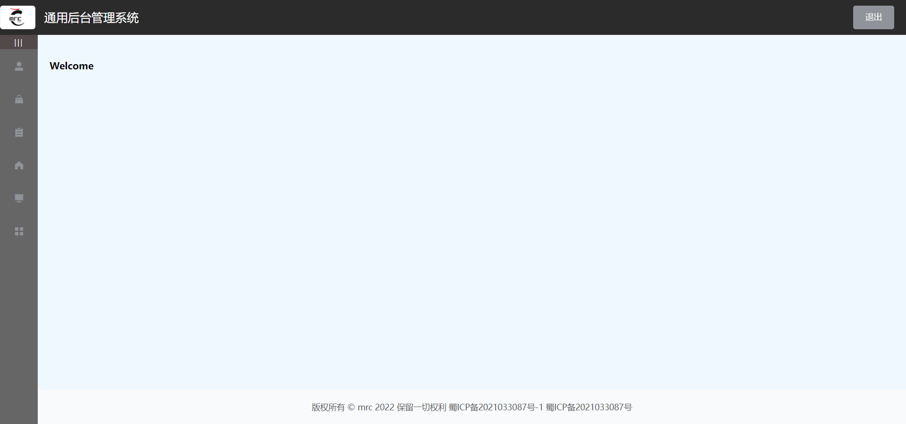
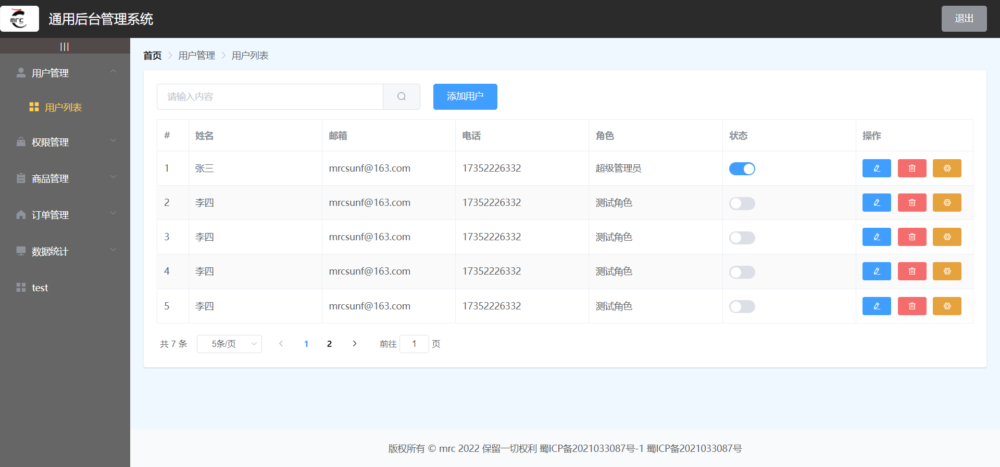
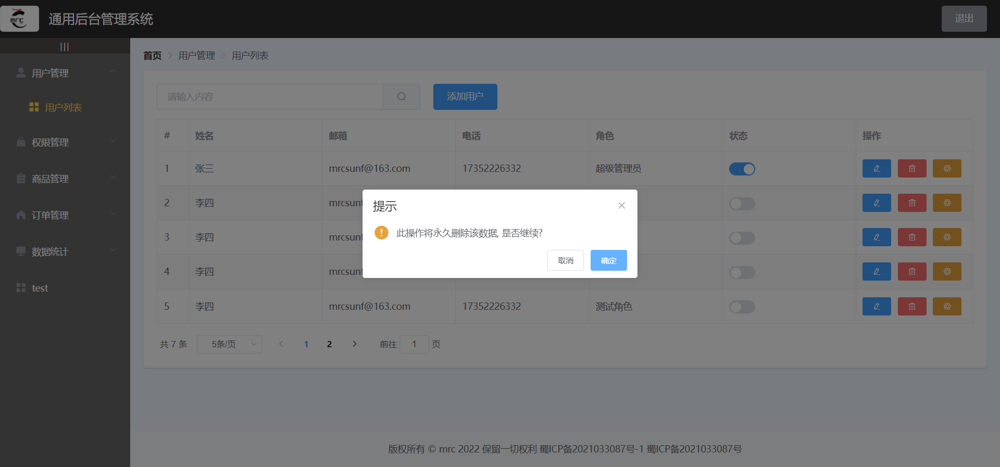
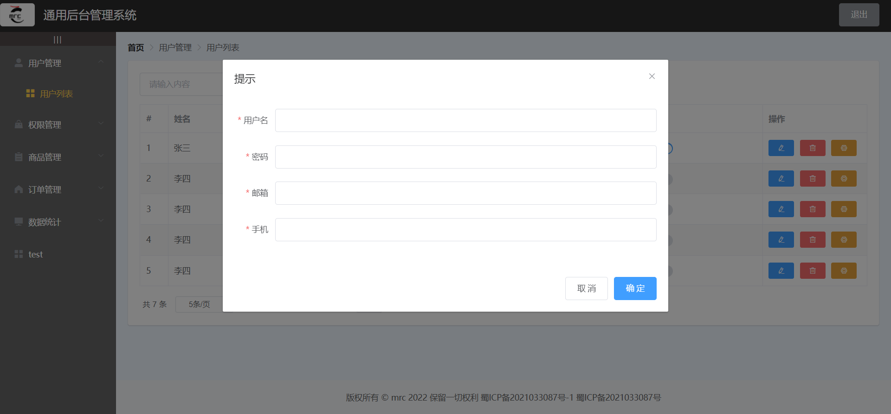

# vue-manage-demo

## 介绍

**vue + element-ui**实现的通用后台管理系统，纯前端，后续会写后端继续更新。

### 技术栈

* vue2
* vue-router
* element-ui

### 已完成的功能：

* 整体布局（头部，左侧导航菜单，右侧主体，右侧底部）
* 登录
* 退出
* 导航菜单展开与折叠
* 导航菜单路由
* 面包屑
* 数据表格（按钮提示）
* 数据分页
* 删除提示信息
* 添加信息弹出表单框（重置表单）

### 运行效果







## Project setup

```
npm install 或 yarn add
```

### Compiles and hot-reloads for development
```
npm run serve 或 yarn run serve
```

### Compiles and minifies for production
```
npm run build 或 yarn run build
```

### Lints and fixes files
```
npm run lint 或 yarn run lint
```

### Customize configuration
See [Configuration Reference](https://cli.vuejs.org/config/).
